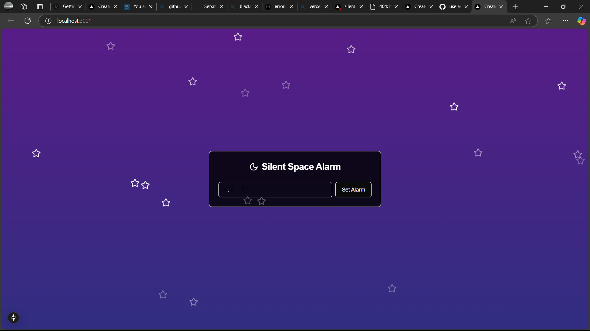
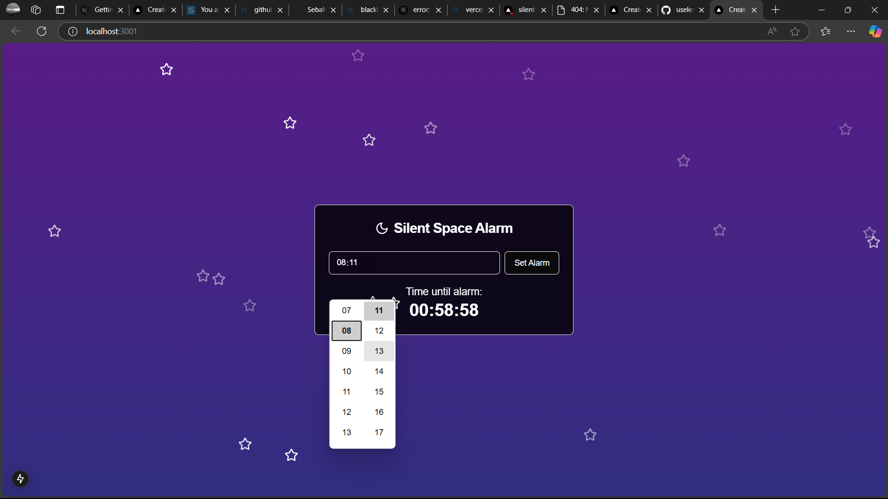
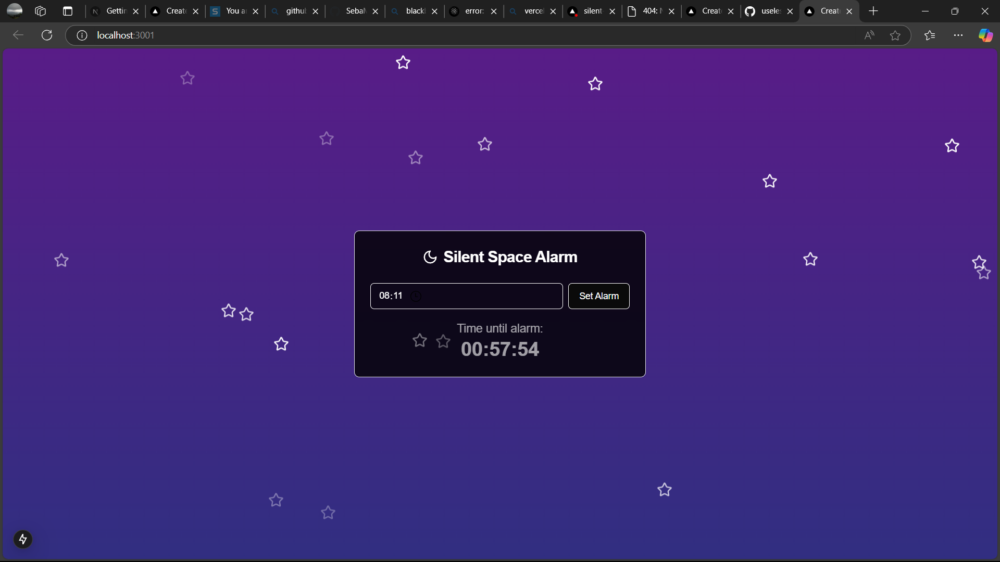

# [silent alarm ] 🎯

# URL
https://silent-alarm.vercel.app/
# Video
https://drive.google.com/file/d/1ZKrlj-CrYOXmAtruK59CJt2CXysBN_Au/view?usp=sharing

## Basic Details
### Team Name: [pls pls]

### Team Members
- Team Lead: [linna theres joy] - [mar baselios christain college of engineering and technology]
- Member 2: [seba mariam george] - [mar baselios christain college of engineering and technology]
- Member 3: [prathibha b] - [mar baselios christain college of engineering and technology]

### Project Description
[The Silent Alarm is an intentionally useless project designed for entertainment and to demonstrate basic  programming skills. It is a "stealthy" alarm system that alerts the user by doing absolutely nothing. The idea is to mimic an actual alarm system without  any practical functionality  or impact]

### The Problem (that doesn't exist)
[The world is filled with people who struggle to wake up on time, often relying on loud, jarring alarms that disrupt their sleep. These traditional alarms can lead to stress, fatigue, and a negative start to the day.]

### The Solution (that nobody asked for)
[Introducing the "Silent Alarm," the ultimate tool for those who prefer to sleep through their alarms. With no annoying sounds to disturb their peaceful slumber, users can rest easy, knowing that their alarm will go off without waking them up.]

## Technical Details
### Technologies/Components Used
For Software:
- Typescript
- React js
- Tailwind css

### Implementation
For Software:

# Run
(https://silent-alarm.vercel.app/)
### Project Documentation
For Software:

# Screenshots (Add at least 3)

Home page

Option selection

Final output

### Project Demo
# Video
https://drive.google.com/file/d/1ZKrlj-CrYOXmAtruK59CJt2CXysBN_Au/view?usp=sharing

## Team Contributions
- [linna theres joy]: [helped  in creating code ]
- [seba mariam george]: [helped in creating code]
- [prathibha b]: [helped in creating a code]

---
Made with ❤️ at TinkerHub Useless Projects 

